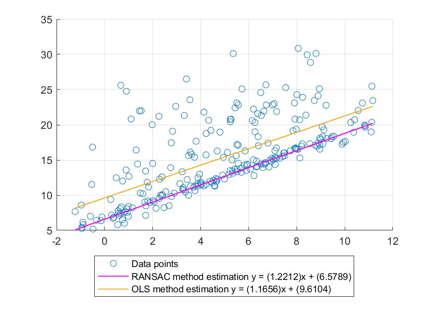
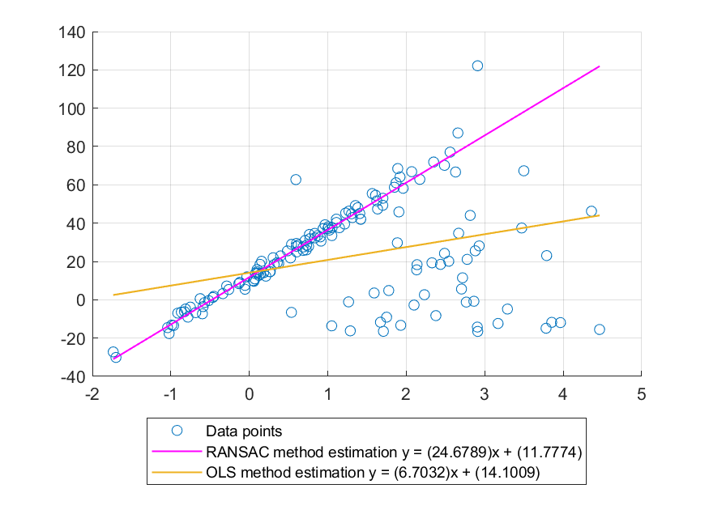
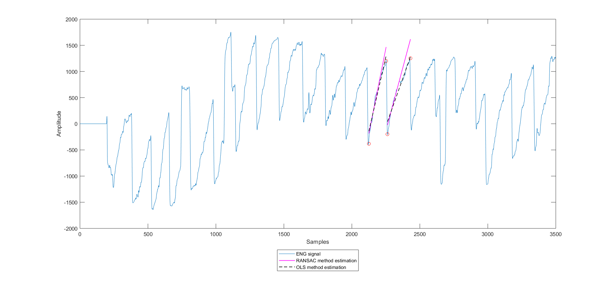

Ordinaty least squares (OLS) enable linear regresion parameters. In this implementation I used matrix formulation well explained [here](https://en.wikipedia.org/wiki/Ordinary_least_squares#Matrix/vector_formulation). 

Random sample consensus (RANSAC) is an iterative method to estimate parameters of a mathematical model from a set of observed data that contains outliers, when outliers are to be accorded no influence on the values of the estimates. Therefore, it also can be interpreted as an outlier detection method. 

RANSAC method consists of the following steps:
1. Random choose the minimum number of points (M) necessary to determine model's parameteres. For linear regression M == 2. 
2. Estimation of model parameters for chosen points.
3. Check which elements of the entire dataset are consistent with the instantiated model with tolerance k > 0.
4. Check if ratio of inliers to entire dataset is higher assumed threshold t > 0. 
5. If true then instantiated model is model for dataset if not repeat steps 1-4. 
6. Afterwards, the model may be improved by reestimating it using all inliers. 

Repo consist implementation of above algorithms. Furthermore there is tool implemented which allows load signal (eg. ENG signals) and select its part for RANSAC estimation. 

Img 1: RANSAC and OLS comparision

Img 2: RANSAC and OLS comparision

Img 3: Screenshot from tool

ENG data: http://www.physionet.org/physiobank/database/#neuro
